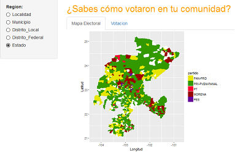
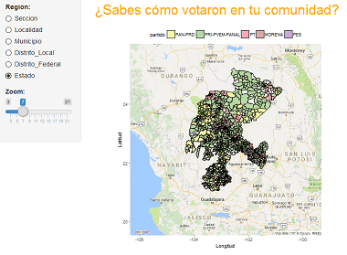

# Elecciones Gubernamentales 2016

## Voto por región

Para visualizar el voto ciudadano usando un shapefile como el que se muestra ejecuta los comandos que se muestran abajo de la imagen desde la plataforma de R.


```R
library(shiny)
runGitHub("elec_gob", "ivanps", subdir = "shape_voto_region")
```

## Voto por región usando ggmap

Para visualizar el voto ciudadano usando ggmap como el que se muestra ejecuta los comandos que se muestran abajo de la imagen desde la plataforma de R.


```R
library(shiny)
runGitHub("elec_gob", "ivanps", subdir = "ggmap_voto_region")
```
